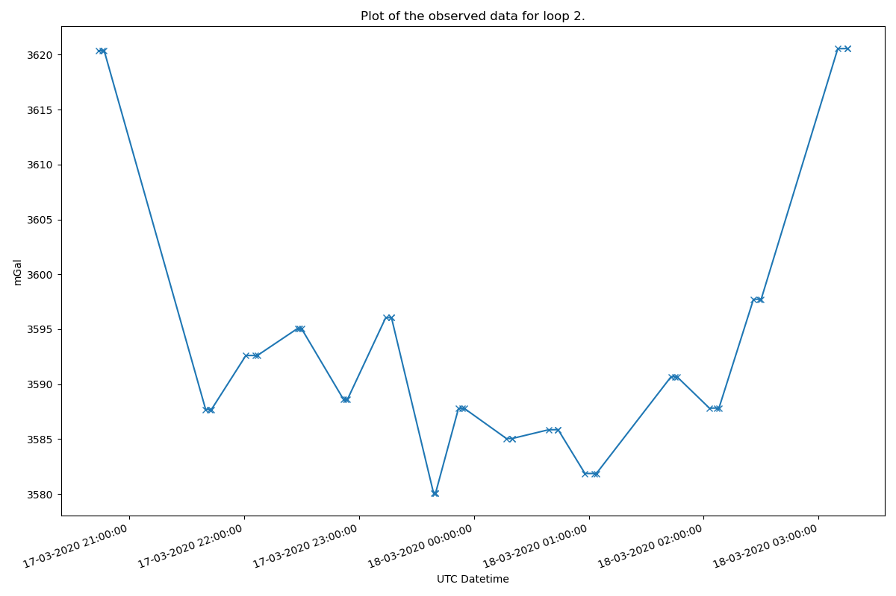
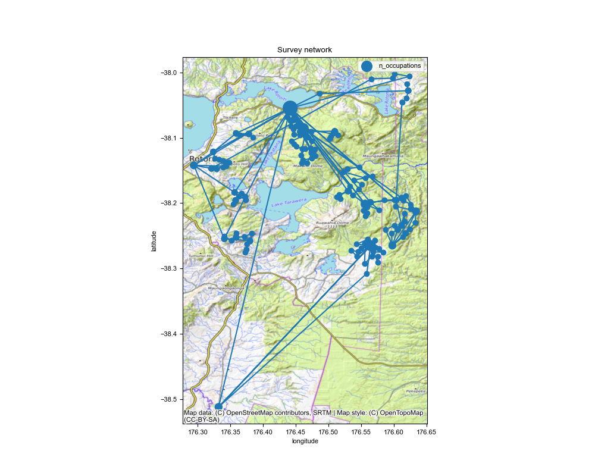
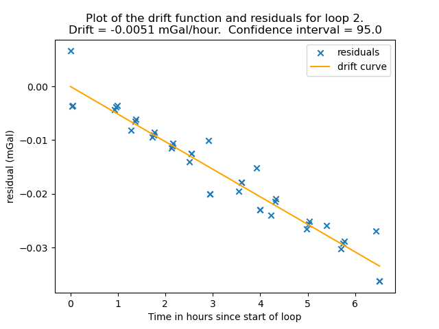
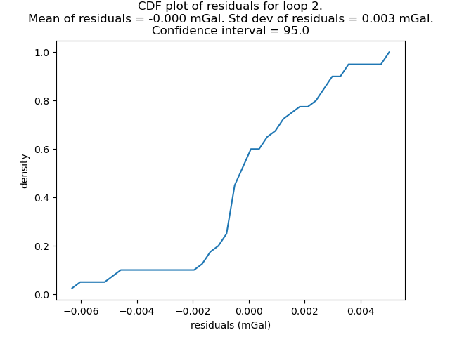

# Running gSolve for network adjustment on relative gravity readings

```{tip}  Example script to process the Okataina data in the examples folder.
```

```python
import pathlib

try:
    import contextily as cx
except ImportError:
    has_contextily = False
else:
    has_contextily = True

from gsolve import (
    GravityAnomalies,
    GravityCorrectionParameters,
    GravityObservations,
    GravitySites,
    GravitySurvey,
    LaCosteRombergDialConverter,
    ReferenceGravity,
)
from gsolve.tide.earth_tide import LongmanTidalCorrection, EternaPredictTidalCorrection
from gsolve.reports import GSolveReport

```

Here we assume the data are in an excel spreadsheet (xlsx) with a "Survey Data" and "locations" tab

You can also supply individual csv files for ```GravitySites``` and ```GravityObservations``` using ```.from_csv```

```python
data_path = pathlib.Path(__file__).parent.parent

obs_path = data_path / "surveys" / "Okataina"

survey_file = obs_path / "Okataina_2020_all_4_gsolve.xlsx"

ref_site_file = data_path / "absolute_gravity" / "base_stations.csv"

corr_table_file = data_path / "correction_tables" / "G106.csv"
```

The calibration factor for your meter (determined in calibration survey). Previously referred to as the "beta factor" in older gSolve versions.

In previous gui-based gSolve versions the calibration factor (then called beta_factor) was output as a correction to a unit factor of 1 i.e. a beta_factor was a small number close to 0.

To convert your old beta_factor to a calibration factor use  ```calibration_factor = 1 - beta_factor```

```{tip}  If you calculated the calibration factor using gSolve version 5 then just use the calibration factor as is.
```

Note the calibration factor is used as ```gcorr = reading * calibration_factor```

```python
calibration_factor = 1- -0.0019
```

## Read in the gravity survey data

Here we create both observation and sites objects.  Observations contain the gravity data while sites contain the GNSS location data of each station.
Note we have the date time information split into separate "day", "month", "year", "hour", "minute" columns hence we use parse_split_datetime=True

```python
obs = GravityObservations.from_excel(survey_file, sheet_name="Survey Data", parse_split_datetime=True)
```

### Read in site location information

```python
sites = GravitySites.from_excel(survey_file, sheet_name="Locations")
```

### Read in list reference (i.e. absolute) stations

To process the data from relative to absolute we require a list of absolute "reference" stations that the relative survey has occupied.

```python
ref_sites = ReferenceGravity.from_csv(ref_site_file)
```

set which reference stations are used in this survey (must be in sites)

```python
_ = sites.set_reference_gravity(ref_sites)
```

## Process the observed data

As this is a manually read G meter we need to convert dial values to mgal via a
conversion table. First read in the conversion table

```python
g106converter = LaCosteRombergDialConverter.from_csv(corr_table_file)
```

apply dial conversion to convert values to mGal.

```python
obs.apply_dial_to_mgal(g106converter)
```

set the calibration factor

```python
obs.set_calibration_factor(calibration_factor)
```

### Calculate the earth tide correction

This requires location information from the sites object.  There is the option of using the Longman formula or ETERNA Predict with a choice of tidal potential models.
Refer to [pygtide documentation](https://github.com/hydrogeoscience/pygtide) for other options.

```python
longman = LongmanTidalCorrection(amp_factor=1.2)
obs.apply_earth_tide_correction(sites, tide_corrector = longman)
```

Another option is to use pygtide for corrections which uses the more accurate ETERNA tidal model.

```python
eterna = EternaPredictTidalCorrection(tidalpoten=8)
obs.apply_earth_tide_correction(sites, tide_corrector = eterna)
```

Other tidal parameters for Eterna can be set through ```set_tidal_params``` once the tide correction object is initialised. e.g. ```eterna.set_tidal_params([0, 100, 1.15, 0])```

### Calculate earth tide corrected gravity

```python
obs.calculate_tide_corrected_gravity()
```

### Plot the observed data

Plot the observed data for each loop to check for input errors.  Here we plot for loop #2

```python
obs.plot_observed_data(2, "datetime", "meter_reading_mgal")
```



### Plot a network map

Make a map of the network of sites.  Dots are scaled by the number of occupations.

```python
fig, ax = obs.plot_network_map(
    sites,
    savefilename=str(obs_path) + "/ Okataina_network_map.png",
    figsize=(10, 8),
    marker_scale_factor=25,
)

# add a basemap (optional)
if has_contextily:
    cx.add_basemap(ax, source=cx.providers.OpenTopoMap, crs="EPSG:4326")
    fig.savefig(str(obs_path) + "/ Okataina_network_map.png")
```



### Create a survey object using observations and site objects

```python
survey = GravitySurvey(obs, sites)
```

## Run the network adjustment

Here we use solve method "2", see [gSolve algorithms](gsolve_algorithms.md) documentation.  We process each loop individually
and apply a 99 percentile cutoff filter to the residuals.  As this is not a calibration
survey we do not need to calculate the calibration factor

```python
results = survey.solve_lstsq(method=2, use_loops=True, calculate_calibration=False, percentile_clipping=95)
```

```{tip}
```results.site_solution``` contains the adjusted gravity per station
```python
print(results.site_solution)
```

```{tip}
```results.obs_solution``` contains the residuals for each reading.
```python
print(results.obs_solution)
```

### Plot drift and residual curves

Note: you can use loop="all" to plot the ```residual_cdf``` of all loops together.

```python
results.plot_residual_drift(loop=2, filename=str(obs_path) + "/ Okataina_residual_drift.png")
results.plot_residual_cdf(loop=2, filename=str(obs_path) + "/ Okataina_residual_cdf.png")
```




### Save output files

as individual csv files

```python
results.site_solution.to_csv(obs_path / "Okataina_site_solution.csv")
results.obs_solution.to_csv(obs_path / "Okataina_observations_solution.csv")
```

## Calculate Corrections and Anomalies

If you want to carry on and calculate corrections and anomalies.

Define parameters for calculating gravity corections and anomalies.

```python
correction_params = GravityCorrectionParameters(
    ellipsoid="GRS80",
    density_crust=2670.0,
    density_water=1030.0,
    spherical_cap_radius=166735.0,
    use_curvature_corrected=True,
    use_atmospheric_correction=True,
)
```

```use_curvature_corrected``` applies the Bullard "B" curvature correction for the Bouguer slab.
```use_atmospheric_correction``` applies the atmospheric correction for the air mass above the station.

### calculate anomalies

Anomalies are calculated using ```normal_gravity_at_ellipsoid```.

```python
anomalies = GravityAnomalies(
    absolute_gravity=results,
    sites=survey.sites,
    corrections_parameters=correction_params,
    terrain_corrections=None,
)

anomalies.data
```

## Final report

```python
report = GSolveReport(
    observations=obs,
    results=results,
    sites=survey,
    anomalies=anomalies,
)
report.to_excel(obs_path / "okataina_survey_results.xlsx", if_workbook_exists="replace")
```
