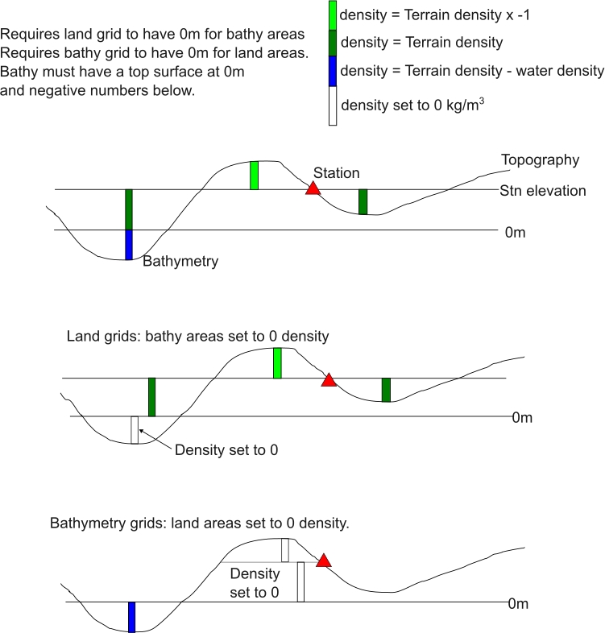

# Terrain corrections

Terrain corrections are undertaken using the Harmonica ```prism_gravity``` as the basic building block.

[See Harmonica documentation](https://www.fatiando.org/harmonica/latest/api/generated/harmonica.prism_gravity.html#harmonica.prism_gravity)

Terrain corrections are calculated in a series of discrete steps where the correction for different parts of the topography are calculated separately and added together.

Gravity values are calculated at the exact coordinate location supplied.

The figure below illustrates how prisms are constructed and assigned densities.



Terrain correction calculations in gSolve works by estimating the gravity effect of the topography in a series of zones around the observation site. Each zone has a minimum and maximum distance.

The user imports the appropriate topography (or bathymetry) grid and observation location data.  Terrain and water densities, and minimum and maximum calculation distances are also required to be supplied.

```{tip} gSolve can handle most grid formats readable by GDAL.  Tiff is well tested and preferred.
```

There is a choice of ```radial``` distance or ```rectangular``` distance.

The algorithm trims the DEM to a box around the stations plus the ```max_dist```.  This reduces the number of prisms needed to be created and reduces memory.

See the script in the examples/surveys/terrain_corrections folder.

Bathymetry grids must have negative values.

To avoid duplicate calculations the following tips are useful.

```{tip} gSolve can handle DEM that have both topography and ocean bathymetry in the same grid.
```

```{tip} gSolve land only DEM should have bathymetry areas set to 0m.  Land values are positive.
```

```{tip} gSolve bathymetry grids should have land areas set to 0m.  Bathymetry values are negative.
```

```{tip} Grids and station coordinates must be in cartesian form.  DEM must be supplied as gridded data, not x,y,z files.
```

In ```TerrainCorrectionParameters``` there is an option ```compute_bathymetry``` or ```compute_topography```. For grids that contain both topography and bathymetry this can be used to set which part is computed.  The parameter ```sea_level_elevation``` can be used to control the boundary between topography and bathymetry (default = 0).

The ```Sites``` object has a method ```sample_elevation()``` which can be used to extract the value of the DEM at the station location.  This can be useful if the DEM values are preferred to the surveyed positions or if you want to convert station ellipsoidal heights to orthometric (assuming the DEM is in orthometric heights).  A new column (```output_col=```) is created in the sites object for the interpolated DEM height and is used by setting the ``site_height_field`` in the ```TerraincCorrectionParameters```.

```{tip} If you are manipulating grids outside of gsolve they must be returned to gsolve as xarray.DataArray objects not numpy objects.
```

```{tip} Densities are supplied in kg/m3.
```

## Terrain correction calculations over land

It is best to optimise processing time by selecting the appropriate cell size for grids. Tests show that a cell size less than 1/5 the distance to the observation site is satisfactory for getting reliable results in hilly terrain.

Typically the grids used at GNS are:

* 1m grid for terrain correction calculations between 2 and 170 m
    (derived from LIDAR data where available)

* 10m grid for terrain correction calculations between 170 and 2610 m
    (derived from LIDAR data where available, or the LINZ 8m dem)

* 250m grid for terrain correction calculations between 2610 and 21900 m
    (derived from the resampled LINZ 8m dem)

* 2000m grid for terrain correction calculations between 21900 and 167000 m
    (derived from the resampled LINZ 8m dem)

## Terrain correction calculations over the oceans

Terrain correction calculations over water bodies require bathymetry grids for each set of specified radii.

Bathymetry grids need to be in elevation (i.e., negative numbers below sea level).

Calculating the terrain corrections over water bodies is a one-step process (unlike older gSolve no "airgap" calculation is required).  Ensure the station elevation matches the DEM at each location.

In the oceans a density of 1640 is used for bathymetry grids (assuming land density of 2670 and water density 1030 kg/m3). This gives a correction of 1640 below the water surface and 2670 above the water surface.

The user only needs to supply land and water densities and the other densities are calculated.

For calculation over the oceans the grids used at GNS are:

* 1m grid for terrain correction calculations between 2 and 170 m
  (derived from LIDAR or high resolution swath bathymetry data where available)

* 10m grid for terrain correction calculations between 170 and 2610 m
  (derived from LIDAR or high resolution swath bathymetry data where available or resampling the NIWA 250m dem)

* 250m grid for terrain correction calculations between 2610 and 21900 m
  (derived from the NIWA 250m dem)

* 2000m grid for terrain correction calculations between 21900 and 167000 m
  (derived from the resampled NIWA 250m dem)
